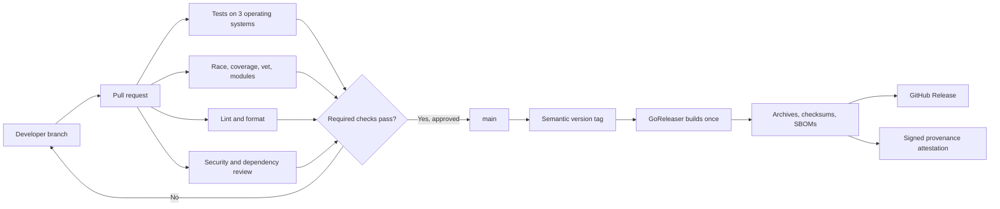

# CI/CD for Charta: concepts, GitHub Actions, and Go tooling

This guide explains both the pipeline in this repository and the ideas behind
it. It is intentionally more detailed than a normal project document so it can
also be used as a learning resource.

The implementation was designed for a public GitHub repository, Go 1.26 or
newer, and a command-line application that can be cross-compiled without CGO.
The repository does not deploy a server or a container. Its delivery target is
therefore a GitHub Release containing downloadable binaries.

## The short version

Every pull request receives four kinds of feedback:

1. **Correctness:** tests run on Linux, macOS, and Windows. A separate Linux
   job runs the race detector, `go vet`, coverage, module checks, and a build.
2. **Code quality:** golangci-lint runs the linters selected in
   `.golangci.yml`, and its formatter verifies `gofmt` and `goimports` output.
3. **Security:** govulncheck finds reachable known vulnerabilities, CodeQL
   analyzes source flows, and Dependency Review rejects newly introduced
   vulnerable dependencies.
4. **Release readiness:** the same Go version, module files, build flags, and
   GoReleaser configuration used by releases are kept in the repository.

After a reviewed commit reaches `main`, pushing a tag such as `v1.2.3` invokes
GoReleaser. It builds six binaries, packages them, generates checksums and
SBOMs, creates a GitHub Release, and asks GitHub to sign a provenance
attestation using OIDC and Sigstore.



## 1. CI/CD theory

### Continuous integration

Continuous integration, or CI, is the practice of integrating small changes
frequently and validating each integration automatically. CI is not merely “a
server that runs tests.” A useful CI system creates a short, reliable feedback
loop and protects the main branch from changes that do not satisfy the team's
definition of acceptable software.

Typical CI gates include compilation, tests, formatting, linting, vulnerability
checks, and packaging validation. A gate should be:

- **Deterministic:** the same source and toolchain should give the same result.
- **Actionable:** failures should identify what must be fixed.
- **Fast enough:** developers must still care about the result when it arrives.
- **Required:** an ignored red check is only a dashboard decoration.
- **Reproducible locally:** CI should not be the only place a command can run.

This repository exposes local equivalents through `make` so the feedback loop
can begin before a push.

### Continuous delivery versus continuous deployment

The similar names hide an important distinction:

- **Continuous delivery** means every accepted change can be released safely,
  but a human decides when to release it. In this repository, the human action
  is creating and pushing a semantic-version tag.
- **Continuous deployment** means every accepted change is automatically
  deployed to users or production with no release decision. That model suits
  services more naturally than a downloadable CLI.

Charta implements continuous delivery. A merge to `main` does not publish a
binary. A `vMAJOR.MINOR.PATCH` tag does.

### Pipeline, stage, gate, artifact, and deployment

- A **pipeline** is the entire automated path from source validation to
  delivery.
- A **stage** is a logical phase such as test, security, or release.
- A **gate** is a condition that must pass before work can advance.
- An **artifact** is an output retained beyond a command: a coverage profile,
  binary, archive, SBOM, or checksum file.
- A **deployment** changes a running environment. Publishing a CLI archive is a
  release/delivery operation, not a server deployment.

### Build once and immutability

An important release principle is “build once, promote the same bytes.” If a
binary is rebuilt after testing, the released binary is technically a different
artifact. The release workflow therefore lets GoReleaser build, package, hash,
and publish in one job. Its checksum manifest identifies the exact released
bytes, and the provenance attestation binds those hashes to the GitHub workflow
that created them.

Tags and published releases should be treated as immutable. If `v1.2.3` is
wrong, fix the source and publish `v1.2.4`; do not silently replace the assets
behind `v1.2.3`.

### Shift-left and defense in depth

“Shift left” means moving feedback earlier in the software lifecycle. A
dependency review during a pull request is cheaper than discovering the same
vulnerability after release.

No single security tool sees everything, so the pipeline layers defenses:

- golangci-lint and `gosec` detect suspicious code patterns;
- `govulncheck` correlates known Go vulnerabilities with reachable functions;
- CodeQL reasons about data flow across functions and packages;
- Dependency Review evaluates dependency changes before merge;
- Dependabot proposes updates after new versions appear;
- checksums detect corruption;
- SBOMs describe release contents;
- attestations identify where and how release artifacts were built.

These tools complement code review. They do not replace it.

## 2. How GitHub Actions executes a workflow

Workflow files live under `.github/workflows/`. GitHub parses each YAML file and
creates workflow runs in response to configured events.

### `name`

The top-level `name` is the workflow name shown in the Actions UI. It also
becomes part of a status-check name, so changing it can break a repository
ruleset that requires the old check.

### `on`

`on` defines events:

- `pull_request` validates the proposed merge result before it reaches `main`.
- `push` validates commits that actually reached `main`, including direct
  pushes if repository rules accidentally allow them.
- `schedule` executes from the default branch on a UTC cron schedule. Security
  data changes even when source does not, so weekly rescanning is useful.
- `workflow_dispatch` adds a manual Run workflow button for diagnostics.
- a tag filter under `push` turns a Git tag into a release event.

The workflows deliberately do not use `pull_request_target`. That event has a
write-capable base-repository context and is dangerous when combined with
checkout or execution of untrusted pull-request code.

### `permissions` and `GITHUB_TOKEN`

GitHub creates a short-lived `GITHUB_TOKEN` for each job. The `permissions`
block limits what that token can do. Once any explicit permission is declared,
unspecified permissions become `none`.

The normal CI and lint workflows only need `contents: read`. CodeQL additionally
needs `security-events: write` to upload findings. Only the tag-restricted
release job receives `contents: write`, OIDC, and attestation permissions.

This is least privilege: a compromised test command cannot create a release.
Repository secrets are not used by pull-request jobs, and GitHub withholds
secrets from untrusted forks by default.

### `jobs`, runners, and isolation

A workflow contains jobs. Jobs are independent by default and can run in
parallel. Each job gets a clean runner virtual machine identified by `runs-on`.
Files created in one job are not visible in another unless explicitly uploaded
as artifacts and downloaded later.

GitHub-hosted labels such as `ubuntu-latest` are moving images. The Go version
is therefore not taken from whatever happens to be preinstalled: `setup-go`
reads `go.mod` and installs the required toolchain.

`timeout-minutes` prevents a hung test or external tool from consuming runner
minutes forever.

### Steps: `run` versus `uses`

A job contains ordered steps:

- `run` executes a shell command on the runner.
- `uses` invokes a reusable Action published from another repository.

Every `uses` reference here is a full 40-character commit SHA. A tag such as
`@v7` can be moved by its owner; a commit SHA is immutable. The nearby comment,
for example `# v7.0.1`, preserves readability. Dependabot understands these
references and proposes newer verified versions.

### Matrix strategy

The test job defines an operating-system matrix. GitHub expands one job
definition into three jobs. `${{ matrix.os }}` is an expression evaluated by
GitHub before the runner starts.

`fail-fast: false` means a Linux failure does not cancel macOS and Windows. The
extra signals often reveal whether the bug is platform-specific.

### Expressions and contexts

`${{ ... }}` is GitHub's expression language, not shell syntax. Contexts expose
structured workflow data:

- `github` describes the event, ref, repository, actor, and run;
- `matrix` contains the current matrix combination;
- `runner` contains paths such as the runner's temporary directory;
- `secrets` exposes allowed secrets without placing them in the YAML;
- `steps` and `needs` expose outputs from earlier work.

Shell variables such as `$GITHUB_REF_NAME` are expanded later by Bash. Knowing
which interpreter owns an expression prevents many quoting and security bugs.

### Concurrency

CI, lint, and security use a group made from the workflow name and Git ref. A
new push to the same branch cancels the older in-progress run. The older result
is obsolete and does not deserve more compute.

Release runs are different: `cancel-in-progress` is false. Publishing is a
side effect, so a newer event must not interrupt an older release halfway
through.

### Caches versus artifacts

A **cache** accelerates later runs and may be discarded at any time. `setup-go`
caches module downloads and Go build data using `go.sum` as dependency input.
Correctness must never depend on a cache hit.

An **artifact** is an intentional output for people or later jobs. The CI
workflow retains `coverage.out` and a readable coverage report for 14 days.
Release archives are not workflow artifacts; they are durable GitHub Release
assets.

### Job summaries and logs

Writing Markdown to `$GITHUB_STEP_SUMMARY` adds information to the run summary.
The coverage gate uses this instead of an external coverage service. Command
stdout and stderr remain available in individual step logs.

## 3. Workflow-by-workflow explanation

### `.github/workflows/ci.yml`

The `Test` matrix runs `go test -shuffle=on ./...` on all supported desktop
operating systems. `./...` means every package in the current module and its
subdirectories. `-shuffle=on` randomizes test execution order and prints a seed;
if order-dependent state causes a failure, rerun with that seed.

The Linux `Quality gate` is intentionally stronger:

1. `go mod download` obtains modules declared by `go.mod` and `go.sum`.
2. `go mod verify` compares cached module contents with recorded hashes.
3. `go mod tidy -diff` calculates the changes `tidy` would make without
   rewriting files. A diff means dependency metadata was not committed.
4. `go vet ./...` applies compiler-aware correctness checks from the Go
   toolchain. It is not a stylistic linter.
5. `go test -race` instruments memory access to detect unsynchronized shared
   state. Race builds are slower and larger, so one representative runner is a
   practical balance.
6. `-covermode=atomic` records concurrency-safe statement counters. Atomic mode
   is required when coverage and the race detector run together.
7. `-coverprofile=coverage.out` writes the profile consumed by `go tool cover`.
8. The shell extracts the total statement percentage and fails below 50.0%.
   The implementation baseline was 55.8%, giving modest headroom without
   allowing a large regression.
9. `go build -trimpath` verifies the real command package and removes local
   filesystem paths from build metadata.

Coverage is not proof of correctness. It answers “which statements executed,”
not “were all important inputs and outcomes asserted?” The floor is a guardrail,
not a target to game.

### `.github/workflows/lint.yml`

The workflow installs golangci-lint 2.11.0 using its official Action and then
runs two distinct commands:

- `golangci-lint fmt --diff ./...` checks the configured `gofmt` and `goimports`
  formatters without rewriting CI's checkout.
- `golangci-lint run --timeout=5m ./...` runs `.golangci.yml` as the source of
  truth for enabled analyzers.

Important enabled linters include:

- `errcheck`: ignored errors;
- `errorlint`: incorrect error wrapping or `errors.Is`/`errors.As` usage;
- `govet`, `staticcheck`, `ineffassign`, `unused`: correctness and dead code;
- `gosec`: common security-sensitive patterns;
- `bodyclose`, `sqlclosecheck`, `noctx`: resource and context lifecycle;
- `nolintlint`: requires a specific linter name and explanation on suppressions;
- `unconvert`: redundant conversions;
- `misspell`, `revive`: text and maintainability checks.

The configuration also records a small, explicit baseline of false-positive or
low-value findings. For example, test strings that intentionally look like
passwords are excluded only from gosec's `G101` rule, and only in `_test.go`
files. Optional Staticcheck quick-fix (`QF`) suggestions and missing godoc on
symbols inside `internal/` packages are not release blockers. Narrow exclusions
are preferable to disabling a whole linter: all of its other rules continue to
protect new code. Each exclusion should be periodically reviewed and removed
when the underlying code changes.

Fix the cause of a warning when possible. If a genuine false positive must be
suppressed, use a narrow and explained directive such as:

```go
//nolint:gosec // value is an internal test fixture, never an authentication token
```

A bare `//nolint` hides unrelated future problems and is rejected.

### `.github/workflows/security.yml`

The workflow runs for code changes and every Monday at 04:17 UTC. The unusual
minute avoids the high load commonly seen at exactly midnight or on the hour.

`govulncheck` uses the Go vulnerability database and call-graph information.
It distinguishes a vulnerable module merely present in the graph from a
vulnerable symbol the program can reach, reducing generic CVE noise. Reachable
findings fail the text-mode Action.

CodeQL builds a semantic database directly from Go source (`build-mode: none`)
and applies the `security-extended` query suite. Results are uploaded as code
scanning alerts in GitHub's Security tab. Extended queries trade a little
precision for broader detection.

Dependency Review runs only for pull requests because it compares the base and
head dependency graphs. It blocks newly introduced vulnerabilities rated high
or critical. Existing vulnerabilities remain the responsibility of
govulncheck, CodeQL, Dependabot, and maintainers.

### `.github/dependabot.yml`

Dependabot checks Go modules and GitHub Actions every Monday in the repository's
Recife timezone. Compatible minor and patch updates are grouped to reduce pull
request noise. Major versions remain separate because they may contain breaking
changes and deserve focused review.

Dependabot does not auto-merge. Its pull requests must pass the same gates and
receive the same review as human changes.

### `.github/workflows/release.yml` and `.goreleaser.yml`

The release workflow accepts tags beginning with `v`, then immediately enforces
the exact `vMAJOR.MINOR.PATCH` form. GitHub tag filters are glob patterns, not
regular expressions, so validation inside the job prevents accidental names
such as `version-one` from publishing.

Checkout uses `fetch-depth: 0` because GoReleaser needs tags and history for
version and changelog generation. Syft is installed before GoReleaser because
GoReleaser delegates SBOM cataloging to that executable.

The release job re-runs module verification and the unit suite before it gains
the chance to publish. This matters because a Git tag can technically point at
any commit, including one that never passed the branch checks. Re-validation is
cheap insurance at the irreversible boundary.

GoReleaser builds `./cmd/tui-db` as `charta` for this matrix:

| OS | Architectures | Archive |
| --- | --- | --- |
| Linux | amd64, arm64 | `.tar.gz` |
| macOS (`darwin`) | amd64, arm64 | `.tar.gz` |
| Windows | amd64, arm64 | `.zip` |

`CGO_ENABLED=0` permits cross-compilation from one Linux release runner. The
project's SQLite implementation is Go/Wasm based and does not require a system
SQLite C library.

The linker flags do three jobs:

- `-s -w` remove symbol/debug tables to reduce distributed size;
- `-trimpath` removes build-machine paths;
- `-X` replaces the CLI's `version`, `commit`, and `buildDate` variables so
  `charta version` can identify an installed binary.

Each archive includes the binary, license, README, and installer scripts. The
checksum file uses SHA-256. Syft produces an SPDX JSON SBOM for each archive.
GoReleaser uploads all of these to the release.

Finally, `actions/attest` reads `dist/checksums.txt`. GitHub issues the job a
short-lived OIDC identity, Sigstore signs an in-toto/SLSA provenance statement,
and GitHub stores it with the repository. There is no long-lived signing key to
create, distribute, rotate, or leak.

## 4. Go-specific CI details

### `go.mod`, `go.sum`, and Minimal Version Selection

`go.mod` defines the module path, minimum Go language/toolchain version, and
required modules. Go's Minimal Version Selection chooses one version of each
module across the build list. `go.sum` records cryptographic hashes used to
authenticate downloaded module files; it is not a conventional lockfile that
freezes every possible resolution decision.

Commit both files. Run `go mod tidy` after changing imports or dependencies.
CI uses `tidy -diff` so it reports drift rather than silently repairing the
author's branch.

### Why `go vet` and golangci-lint both run

`go vet` ships with Go and understands compiler/type information. golangci-lint
is an orchestrator for many independent analyzers, including a vet integration.
Running vet explicitly makes the fundamental Go gate visible and usable even
if the external linter configuration later changes. The small duplication is
worth the clarity.

### Race detection is dynamic

The race detector only detects races that execute during the test. A green race
job does not mathematically prove the absence of races. Good tests must exercise
concurrent behavior, and production synchronization still requires careful
design.

### Unit and integration tests

Normal CI does not start PostgreSQL or SQL Server. The repository's network
integration tests are opt-in and skip without connection environment variables.
External databases would add secrets, startup time, health checks, migrations,
and more flaky failure modes.

If these tests become a required gate, use disposable GitHub Actions service
containers, wait for explicit health checks, provision least-privilege test
users, and run:

```sh
go test -count=1 -tags=integration ./...
```

`-count=1` disables test-result caching, which is important when an external
service can change independently of source code.

## 5. Running the pipeline locally

The standard Go commands work with only Go installed:

```sh
make fmt-check
make vet
make test
make test-race
make coverage-check
```

The complete local pipeline additionally requires these tools on `PATH`:

- golangci-lint 2.11.0;
- govulncheck;
- GoReleaser 2.17.1;
- Syft 1.50.0;

Then run:

```sh
make lint-fmt
make lint
make security
make release-check
make ci
```

`make release-check` creates a snapshot in ignored `dist/`; it never publishes
a GitHub Release. `make coverage-check` creates ignored `coverage.out`.

Useful failure investigations:

```sh
# Reproduce an order-dependent test with the seed printed by a failed run.
go test -shuffle=SEED ./...

# Show per-function coverage and generate a browsable HTML report.
go tool cover -func=coverage.out
go tool cover -html=coverage.out -o coverage.html

# Show linter timing and configuration details.
golangci-lint run --verbose ./...

# Show detailed reachable and imported vulnerability information.
govulncheck -show verbose ./...

# Inspect a release without publishing it.
goreleaser release --snapshot --clean

# Validate workflow syntax. actionlint 1.7.7 predates GitHub's required
# artifact-metadata permission, so ignore only that known parser limitation.
actionlint -ignore 'unknown permission scope "artifact-metadata"' \
  .github/workflows/*.yml
```

The `artifact-metadata: write` permission is intentionally retained: current
versions of `actions/attest` use it to register artifact metadata. Removing a
real security permission merely to satisfy an older local schema would make the
workflow less correct. Remove the actionlint exception after its permission
schema catches up.

## 6. Repository settings after pushing the branch

Workflow files create checks, but repository rules make those checks gates.
After this branch is pushed and the first pull request has produced check names,
configure a GitHub ruleset for `main`:

1. Require a pull request before merging.
2. Require at least one approving review and dismiss stale approvals.
3. Require conversation resolution.
4. Require the branch to be current before merging.
5. Require these checks:
   - `CI / Test (ubuntu-latest)`
   - `CI / Test (macos-latest)`
   - `CI / Test (windows-latest)`
   - `CI / Quality gate`
   - `Lint / Go lint and formatting`
   - `Security / Go vulnerability scan`
   - `Security / CodeQL`
   - `Security / Dependency review`
6. Block force pushes and branch deletion.
7. Restrict bypass permission to a small emergency group, with auditing.

In Settings > Actions > General, set the default workflow token to read-only.
The release job still receives its explicitly declared permissions.

In Settings > Security, enable the dependency graph, Dependabot alerts,
Dependabot security updates, code scanning, and secret scanning/push protection
for the public repository.

These settings are deliberately not changed by repository files: they are
server-side policy and require authenticated administrator authorization.

## 7. Creating and verifying a release

Choose a version using Semantic Versioning:

- increment **MAJOR** for incompatible behavior or interfaces;
- increment **MINOR** for backward-compatible features;
- increment **PATCH** for backward-compatible fixes.

After the intended commit is merged and all checks are green:

```sh
git switch main
git pull --ff-only
git tag -a v1.2.3 -m "charta v1.2.3"
git push origin v1.2.3
```

The tag push is the authorization to publish. Watch the `Release` workflow.
Do not create the tag from an unreviewed feature branch.

Download all assets for the release before checking the manifest:

```sh
sha256sum -c checksums.txt
```

On macOS, use `shasum -a 256 -c checksums.txt`. On Windows, PowerShell's
`Get-FileHash -Algorithm SHA256` can compare individual files.

Verify GitHub provenance with a recent GitHub CLI:

```sh
gh attestation verify charta_1.2.3_linux_amd64.tar.gz \
  --repo allus-co/charta-tui
```

Checksum verification answers “are these bytes the bytes named by the
manifest?” Provenance verification additionally answers “did the trusted
GitHub repository workflow produce an artifact with this digest?” Neither one
claims the source code itself is bug-free.

## 8. Operational tradeoffs and intentional exclusions

- **No Docker pipeline:** Charta is an interactive terminal executable and the
  repository has no Dockerfile or container runtime target.
- **No automatic Dependabot merging:** write/merge permissions increase blast
  radius; ordinary review and required checks are safer initially.
- **No external coverage SaaS:** GitHub summaries and artifacts meet the current
  need without another token, service dependency, or privacy policy.
- **No AI reviewer:** it introduces cost, credentials, and a new vendor trust
  boundary. It can be added later as advisory feedback, not as a substitute for
  deterministic gates.
- **No required live-database tests:** they need deliberately managed disposable
  services. Unit and SQLite tests remain fast and stable on every PR.
- **No prerelease tag syntax yet:** the release guard accepts only
  `vMAJOR.MINOR.PATCH`. Supporting `-rc.1` should be a conscious policy change
  that also defines how GitHub marks prereleases.

## 9. Official references

The versions and behavior in this document were reviewed on 2026-08-12. Use
Dependabot and release notes to keep the implementation current.

- [GitHub Actions workflow syntax](https://docs.github.com/actions/reference/workflows-and-actions/workflow-syntax)
- [GitHub Actions security hardening](https://docs.github.com/actions/security-for-github-actions/security-guides/security-hardening-for-github-actions)
- [GitHub workflow concurrency](https://docs.github.com/actions/how-tos/write-workflows/choose-when-workflows-run/control-workflow-concurrency)
- [GitHub artifact attestations](https://docs.github.com/actions/how-tos/secure-your-work/use-artifact-attestations)
- [Go command documentation](https://pkg.go.dev/cmd/go)
- [Go race detector](https://go.dev/doc/articles/race_detector)
- [Go coverage](https://go.dev/blog/cover)
- [Go vulnerability management](https://go.dev/security/vuln/)
- [govulncheck](https://pkg.go.dev/golang.org/x/vuln/cmd/govulncheck)
- [golangci-lint documentation](https://golangci-lint.run/)
- [CodeQL documentation for Go](https://codeql.github.com/docs/codeql-language-guides/codeql-for-go/)
- [GoReleaser documentation](https://goreleaser.com/)
- [Syft SBOM documentation](https://github.com/anchore/syft)
- [Semantic Versioning 2.0.0](https://semver.org/)
- [SLSA supply-chain levels](https://slsa.dev/)
