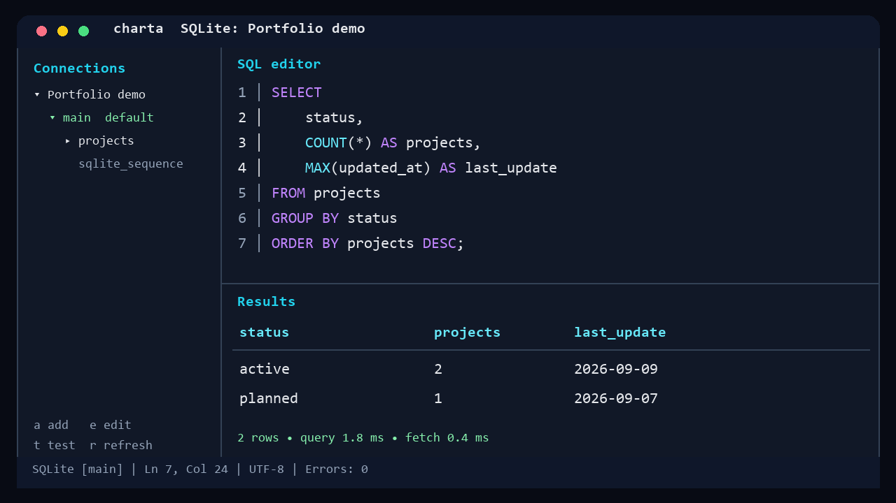

# Charta TUI

[](https://github.com/lucasfguimares/charta-tui/actions/workflows/ci.yml)
[](https://github.com/lucasfguimares/charta-tui/actions/workflows/security.yml)
[](https://github.com/lucasfguimares/charta-tui/releases)
[](LICENSE)

Charta is a keyboard-driven SQL workbench for the terminal. It combines connection management, schema exploration, a dialect-aware editor, query history and result inspection without requiring a desktop database client.

> **Project status:** public beta. Charta is useful today, but its configuration format and keyboard workflow may evolve before v1.0.



[Watch the short terminal demo](docs/assets/charta-demo.gif)

The deterministic preview contains only the bundled SQLite example and can be regenerated with `scripts/generate_demo.py`.

## Why Charta?

- Stay in the terminal while browsing schemas, editing SQL and inspecting results.
- Get highlighting, formatting, autocomplete and fast structural diagnostics for the active database dialect.
- Keep passwords out of profile files through the operating-system keyring.
- Review bounded results with column metadata, PK/FK markers, search and row or cell inspectors.
- Reuse work through local history, favorites and parameterized snippets.

### Português

O Charta é um workbench SQL para terminal, orientado a teclado. Ele reúne conexões, exploração de schemas, editor com suporte a dialetos, histórico e inspeção de resultados. Esta versão é beta; feedback e contribuições são bem-vindos.

## Database support

| Database | Connections | Editor dialect | Default schema behavior |
| --- | --- | --- | --- |
| PostgreSQL | Supported | Supported | Configures `search_path` for the connection |
| Microsoft SQL Server | Supported | T-SQL | Qualifies unqualified relations before execution |
| SQLite | Supported | Supported | Selects `main` or an attached database name |
| MySQL / MariaDB | Not yet | Vocabulary prepared | Planned; no connection driver is exposed |

Charta's local diagnostics are deliberately structural and fast; they are not a complete vendor grammar. The database remains the authority for full syntax validation, and server errors are mapped back to the editor when location data is available.

## Install

### Release archive

Download the archive for your operating system from [GitHub Releases](https://github.com/lucasfguimares/charta-tui/releases), verify it against `checksums.txt`, then install the included binary.

Linux and macOS:

```sh
tar -xzf charta_0.1.0_linux_amd64.tar.gz
./scripts/install.sh ./charta
charta version
```

Windows PowerShell:

```powershell
Expand-Archive .\charta_0.1.0_windows_amd64.zip
Set-Location .\charta_0.1.0_windows_amd64
.\scripts\install.ps1 .\charta.exe
charta version
```

Release archives include checksums, an SBOM and build provenance generated by the release workflow.

### Build from source

Building requires Go 1.26 or newer:

```sh
git clone https://github.com/lucasfguimares/charta-tui.git
cd charta-tui
make build
./bin/charta
```

You can also install directly with Go:

```sh
go install github.com/lucasfguimares/charta-tui/cmd/charta@latest
```

## First query with SQLite

1. Run `charta` and press `a` to add a connection.
2. Select SQLite with `Ctrl+D` and set the database path to `charta-demo.db`.
3. Save with `Ctrl+S`, open a query tab and paste [`examples/demo.sql`](examples/demo.sql).
4. Press `Ctrl+Shift+Enter` to run the complete script.

For PostgreSQL and SQL Server, new profiles default to `public` and `dbo`. SQLite defaults to `main`. The schema browser highlights and expands the selected default schema.

## Editor and safety model

- `Ctrl+Enter` runs the selected statement or the statement at the cursor.
- `Ctrl+Shift+Enter` runs the complete script.
- `Ctrl+Shift+F` formats the selection or current statement.
- `F8` and `Shift+F8` navigate diagnostics.
- Potentially mutating SQL requires confirmation. This is a usability guard, not a security boundary; use a least-privilege database account.
- Query text and result data are not written to activity logs. History is local and sanitizes common credential forms before persistence.

See the complete [keyboard reference](docs/keyboard.md), [architecture overview](docs/architecture.md) and [CI/CD reference](CICD.md).

## Configuration and local data

Profiles expose query timeout, row limit, maximum column width, TLS settings and an optional default schema. Passwords are stored in the OS keyring or kept in memory when no keyring is available.

Canonical paths use the operating system's config and cache locations:

- Profiles: `<config>/charta/connections.json`
- Query history: `<config>/charta/query-history.json`
- Favorites and snippets: `<config>/charta/sql-library.json`
- Activity log: `<cache>/charta/activity.jsonl`

On first startup, Charta migrates files from the former `tui-db` directories when the corresponding Charta file does not exist. Legacy keyring credentials are migrated after a successful read.

## Known limitations

- Local validation catches malformed delimiters, incomplete expressions and selected dialect conflicts, but it does not implement complete PostgreSQL, T-SQL or SQLite grammars.
- SQL Server and SQLite default schemas are applied by token-aware relation qualification. Explicit qualification is recommended for uncommon vendor-specific constructs.
- Open editor tabs are session-only.
- The supported minimum terminal size is 80×24.
- Network integration tests require disposable PostgreSQL or SQL Server instances and are not run by default.

## Contributing and security

Start with [CONTRIBUTING.md](CONTRIBUTING.md). Good first contributions include reproducible parser cases, database-specific tests and accessibility improvements that do not rely only on color.

Do not report vulnerabilities in public issues. Follow [SECURITY.md](SECURITY.md) instead. Community behavior is governed by the [Code of Conduct](CODE_OF_CONDUCT.md).

## License

MIT © Lucas F. Guimarães. See [LICENSE](LICENSE).
